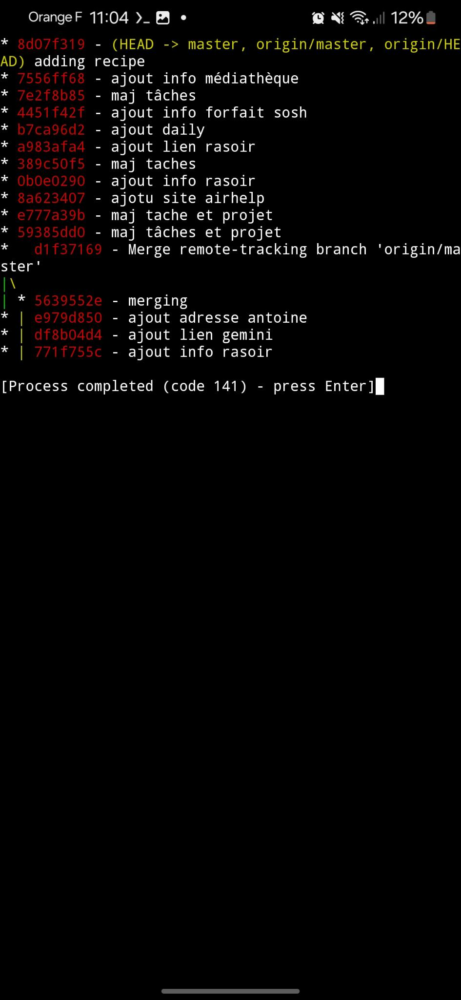

# README

This folders contains bash scripts to be used
by [termux:widgets](https://play.google.com/store/apps/details?id=com.termux.widget)
(see also : <https://github.com/termux/termux-widget>).
to help quick managing of a git repository
It will create scripts in .shortcuts folder for :

- `git add -pick`
- `git add .`
- `git commit -m`
- `git diff`
- `git log`
- `git pull`
- `git push`
- `git reset --hard`
- `git reset --pick`
- `git status`

Once installed you will get a screen like following :





## Installation

Installation can be customised using a Makefile.

- You need "termux" application. Available for free on Play Store
- You need "termux:widget" application (Available on Play Store, not free)
- launch "termux" application
- `git clone https://github.com/nbossard/termuxwidget-gitshortcuts`
- `cd termuxwidget-gitshortcuts`
- install "make" program if not already done using `./install.sh`
- run `make help` and choose a target

### configuration

Add following line in file ~/.bashrc
```bash
export REPO_FOLDER="/storage/documents/yourrepofoldername"
```

### Provide git credentials

Use a `.netrc` file at the root of your repository.
Sample content :

```netrc
machine github.com
    login nbossard
    password xxxxxxxxxxxxxxxxxxxxxxxxxxxxxx
```

## Alternatives

You can use MGit <https://f-droid.org/fr/packages/com.manichord.mgit/> if you have access to F-droid.
But this program will crash or block often.
There is also a playstore version but only for old smartphones (before android 11).
