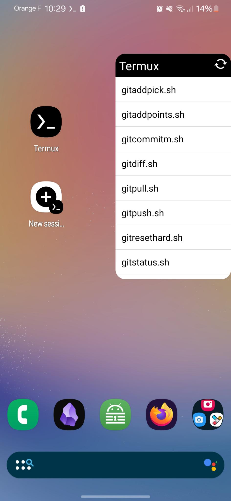

# README

This folders contains bash scripts to be used by termux:widgets for managing a git repository
It will create scripts in .shortcuts folder for :

- `git add -pick`
- `git add .`
- `git commit -m`
- `git diff`
- `git log`
- `git pull`
- `git push`
- `git reset --hard`
- `git status`

Once installed you will get a screen like following :

## Installation

Installation can be customised using a Makefile.

- You need "termux" application. Available for free on Play Store
- You need "termux:widget" application (Available on Play Store, not free)
- launch "termux" application
- `git clone https://github.com/nbossard/termuxwidget-gitshortcuts`
- `cd termuxwidget-gitshortcuts`
- install "make" program if not already done using `./install.sh`
- run `make help` and choose a target
